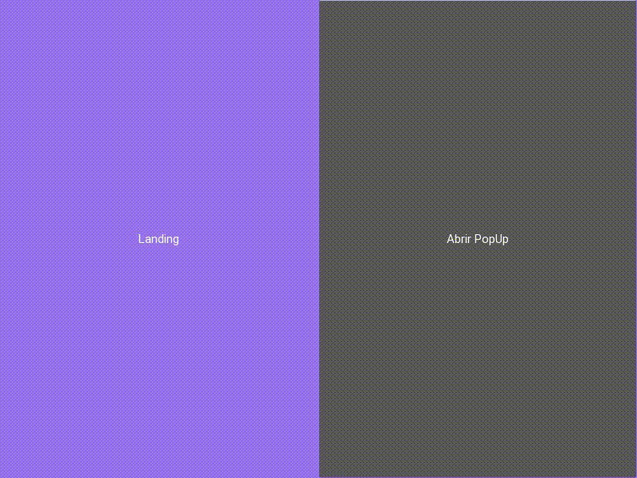

<image alt = "Banner" src='./readme_assets/head.png' align='center' />
<h4 align = "center">
  PopUp with Kivy in Python
</h4>

  

<h3>:muscle: Project</h3> 

This project was developed with the intention of deepening knowledge in the library of graphical <b><a href="https://www.python.org/">Python</a></b> interfaces, called <b><a href="https://kivy.org/#home">Kivy</a></b>.

<h3>:rocket: Technology</h3>

This project was carried out with the following technologies:

<ul>
  <li><a href="https://www.python.org/downloads/release/python-385/">Python 3.8.5</a></li>
  <li><a href="https://kivy.org/#home">Kivy 2.0.0</a></li>
</ul>

<h3>:information_source: How to use?</h3>

Extremely simple, just follow the step by step:

<ul>
  <li>Intall all dependences --> "python 3.8.5" and "kivy 2.0.0"</li>
  <li>Clone the repository --> git clone https://github.com/DanielSchwingel/popup-kivy.git</li>
  <li>Access the folder --> cd popup-kivy</li>
  <li>Run of project --> python main.py</li>
</ul>

<h5 align="center">Liked?!  Suggestions?!  <a href="https://www.linkedin.com/in/daniel-filipe-schwingel-a6541515b/">Contact.</a>:facepunch:</h5>
